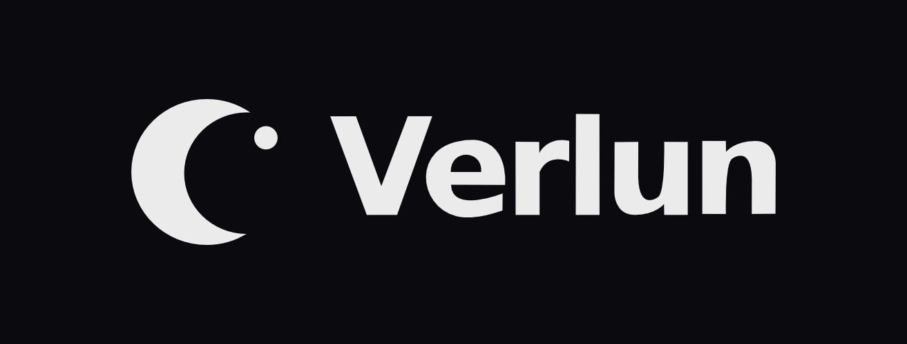

<div align="center">



<br><br>

**Infraestructura digital, simplificada.**

Firma de infraestructura digital · Barranquilla, Colombia · 2025

<br>

[](https://verlun.com)
[](https://linkedin.com/company/verlunstudio)
[](https://instagram.com/verlun)
[](mailto:info@verlun.com)

</div>

<br>

---

<br>

<h2>
  
  &nbsp;Sobre Verlun
</h2>

Construimos el ecosistema digital completo que pequeñas y medianas empresas necesitan para operar, vender, comunicar y crecer.

No somos una agencia de marketing. No somos un freelance de desarrollo. No somos una plantilla de Wix.  
Somos la infraestructura: el software que organiza la operación, la marca que comunica el valor, y el marketing que conecta con el público correcto. Todo bajo la misma firma, la misma visión, el mismo estándar.

> _"Ver"_ — del latín _verum_ y _videre_. Percibir lo verdadero.  
> _"Lun"_ — del latín _luna_. Lo que ilumina cuando todo lo demás se apaga.  
> **Verlun** — hacer visible con claridad lo que las empresas construyen.

<br>

<h2>
  
  &nbsp;Líneas de servicio
</h2>

<table>
  <thead>
    <tr>
      <th width="33%">🔵 Presencia Digital</th>
      <th width="33%">⚙️ Operaciones Inteligentes</th>
      <th width="33%">📡 Comunicación y Crecimiento</th>
    </tr>
  </thead>
  <tbody>
    <tr>
      <td>
        Páginas web<br>
        E-commerce<br>
        Identidad y branding<br>
        Aplicaciones móviles
      </td>
      <td>
        Software a medida<br>
        Dashboards administrativos<br>
        Automatizaciones (N8N)<br>
        Asesorías de procesos
      </td>
      <td>
        Estrategia de contenidos<br>
        Gestión de redes sociales<br>
        Marketing digital<br>
        Comunicación organizacional
      </td>
    </tr>
    <tr>
      <td><em>Líder: Angel De La Torre</em></td>
      <td><em>Líder: Angel De La Torre</em></td>
      <td><em>Líder: María José Guzmán</em></td>
    </tr>
  </tbody>
</table>

<br>

<h2>
  
  &nbsp;Stack técnico
</h2>

<div align="center">


</div>

<div align="center">


</div>

<br>

<h2>
  
  &nbsp;Cómo trabajamos
</h2>

```
01  Diagnóstico       →  Entender el problema real antes de proponer.
02  Propuesta clara    →  Alcance, precio, tiempos. Sin sorpresas.
03  Ejecución          →  Sprints cortos, avances visibles, comunicación constante.
04  Entrega            →  Código fuente, documentación, capacitación.
05  Acompañamiento     →  Soporte post-entrega y evolución del proyecto.
```

Cada proyecto pasa por el mismo proceso. Sin improvisación, sin ambigüedad.  
El cliente recibe código fuente completo y documentación legible — no creamos dependencia, creamos capacidad.

<br>

<h2>
  
  &nbsp;Fundadores
</h2>

<table>
  <tr>
    <td width="100%" align="center">
      <strong>Angel De La Torre</strong><br>
      <em>Cofundador · Representante Legal</em><br><br>
      Desarrollo · Producto · Diseño · Finanzas<br>
      <a href="https://github.com/iangelmanuel">GitHub</a> · <a href="https://linkedin.com/in/iangelmanuel">LinkedIn</a>
    </td>
  </tr>
</table>

<br>

<h2>
  
  &nbsp;Principios
</h2>

|                 |                                                                                       |
| :-------------- | :------------------------------------------------------------------------------------ |
| **Claridad**    | Lo que hacemos se entiende. Lo que entregamos se ve. Lo que cobramos se justifica.    |
| **Permanencia** | Construimos para que dure cinco años, no para impresionar cinco minutos.              |
| **Cuidado**     | Cada entregable pasa por el mismo estándar, sea un post o una propuesta de un millón. |
| **Honestidad**  | Si el problema se resuelve con un SaaS de $200 USD/mes, lo decimos antes de vender.   |

<br>

---

<div align="center">

<br>


<br><br>

_Infraestructura digital, simplificada._

**Barranquilla, Colombia** · info@verlun.com

<br>

</div>
